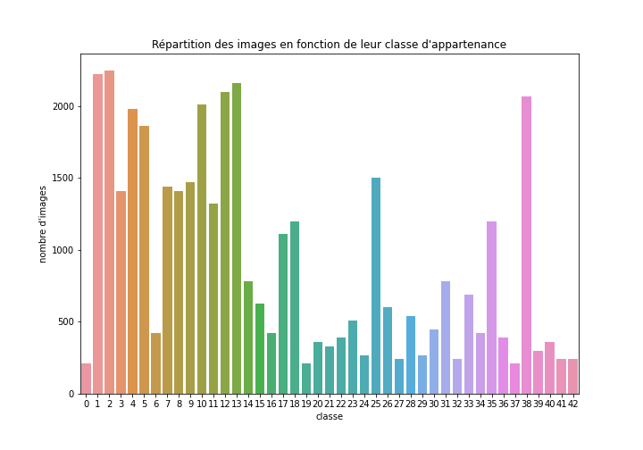
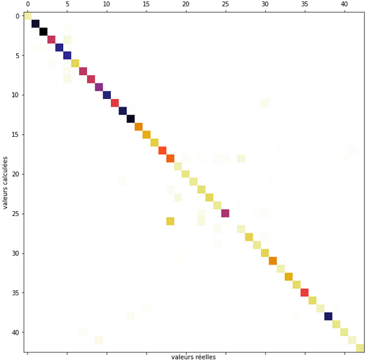
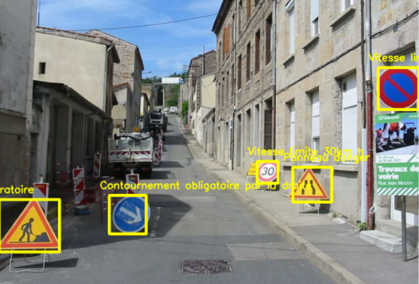

# Détection et reconnaissance de la signalisation routière 

Transfer-Learning avec Tensorflow et Faster-RCNN


<hr>

### Sommaire :
- <a href='#1'>1. Récupération des données</a>
- <a href='#2'>2. Localisation des panneaux dans l'image</a>
- <a href='#3'>3. Reconnaissance du type de panneau</a>
- <a href='#4'>4. Détection et classification sur une photo ou une vidéo</a>
- <a href='#5'>5. Bilan</a>

<hr>

## <a id='1'>1. Récupération des données</a>

Pour la reconnaissance (classification) des panneaux, nous avons utilisé le Dataset GTSRB : https://benchmark.ini.rub.de/gtsrb_news.html

Pour la détection (localisation) des panneaux dans une image, c'est le Dataset GTSDB qui a été utilisé.
https://benchmark.ini.rub.de/gtsdb_news.html

## <a id='2'>2. Localisation des panneaux dans l'image</a>

##### Données concernant la localisation (DETECTION DATASET)

Nous avons téléchargé les images au format `.ppm` ainsi que leurs fichiers `.xml` correspondants. Pour pouvoir exploiter les données avec tensorflow, certains retraîtements ont été nécessaires.

##### Retraitement des images

Voici le script qui nous a permis de passer les images `.ppm` au format `.jpeg`

```python
import os
from PIL import Image

os.chdir("PATH/DIR/TO/IMAGES")
for f in os.listdir():
	if f.endswith("ppm"):
	    im=Image.open(f)
	    name, ext = f.split('.')
	    im.save(name+".jpeg")
```

##### Séparation en données d'entrainement et de test

Nous avons séparé le jeu de données en deux datasets d'entrainement et de test de respectivement 641 et 100 images labellisées.

##### Création de fichiers de métadonnées au format .CSV

Voici un exemple de fichier d'annotation au format `.xml` (ici pour l'image n°00452)

````xml
<annotation>
  <folder>TrainIJCNN2013</folder>
  <filename>00452.ppm</filename>
  <size>
    <width>1360</width>
    <height>800</height>
    <depth>3</depth>
  </size>
  <object>
    <name>road narrows</name>
    <bndbox>
      <xmin>876</xmin>
      <ymin>543</ymin>
      <xmax>914</xmax>
      <ymax>578</ymax>
    </bndbox>
  </object>
</annotation>
````

Le script suivant nous a permis de modifier le contenu du fichier XML pour modifier le contenu de la balise `<filename>` et transformer l'extention `.ppm` en `.jpeg`

```python
import os
import glob
import xml.etree.ElementTree as ET

for xml_file in glob.glob("PATH/TO/LABEL/FILES" + '*.xml'):
    tree = ET.parse(xml_file)
    root = tree.getroot()
    formername = root.find('filename').text
    name, ext = formername.split('.')
    newname = name+".jpeg"
    print(newname)
    root.find('filename').text = newname
    tree.write(xml_file)
```

Par la suite, nous avons décidé de nous servir d'un fichier `.csv`pour exploiter les données plutôt que d'e multiples fichiers `.xml`. Nous avons transformé ces données à l'aide du script suivant, inspiré de celui-ci :https://github.com/datitran/raccoon_dataset/blob/master/xml_to_csv.py

```python
import os
import glob
import pandas as pd
import xml.etree.ElementTree as ET

def xml_to_csv(path):
    xml_list = []
    for xml_file in glob.glob(path + '/*.xml'):
        tree = ET.parse(xml_file)
        root = tree.getroot()
        for member in root.findall('object'):
            value = (root.find('filename').text,
                     int(root.find('size')[0].text), # correspond à 'width' du fichier .xml
                     int(root.find('size')[1].text),
                     int(1), # on veut seulement reconnaître les panneaux, peu importe leur type
                             # on suppose donc une classe unique "road_sign"
                     int(member[1][0].text), # correspond à 'xmin'
                     int(member[1][1].text), # etc.
                     int(member[1][2].text),
                     int(member[1][3].text)
                     )
            xml_list.append(value)
    column_name = ['filename', 'width', 'height', 'class', 'xmin', 'ymin', 'xmax', 'ymax']
    xml_df = pd.DataFrame(xml_list, columns=column_name)
    return xml_df

def main():
    image_path = os.path.join(os.getcwd(), 'IMAGES/test')
    xml_df = xml_to_csv(image_path)
    xml_df.to_csv('IMAGES/test_labels.csv', index=None)
    print('Successfully converted xml to csv.')

main()
```

##### Création de la Label Map

Pour pouvoir untiliser tensorflow Detection API, il est nécessaire de créer une Label Map, qui transforme nos labels en un entier. Dans notre cas, notre Label Map ne contiendra qu'un seul élément : road sign.

```python
item {
    id: 1
    name: 'road_sign'
}
```

Elle est enregistrée dans un dossier TRAINING, qui nous servira également par la suite pour enregistrer les données d'entrainement.

##### Génération des fichiers .record

Pour générer le fichier `.record` nécessaire au processing de Tensorflow Object Detection, nous avons utilisé le fichier `generate_tfrecord.py` de [ce repository github](https://github.com/TannerGilbert/Tensorflow-Object-Detection-API-Train-Model) (qui est lui-même adapté du fichier `generate_tfrecord.py` original de [Tensorflow Detection API](https://tensorflow-object-detection-api-tutorial.readthedocs.io/en/latest/training.html#convert-xml-to-record)).

Les seules modifications que nous avons effectuées sur ce fichier est de modifier ces lignes de la fonction `class_test_to_int()` en fonction de notre label map :

```python
def class_text_to_int(row_label):
    if row_label == 'road_sign':
        return 1
    else:
        None
```

En effet, dans cette étape de détection des panneaux, nous souhaitons seulement détecter les endroits où il existe un panneau, mais nous ne traiton pas encore la reconnaissance du type du panneau. Il n'y a donc qu'une classe à traîter ("panneau"), et non les 43 classes représentant chaque type de panneau.

Nous lançons ensuite la génération des fichiers `train.record` et `test.record` à l'aide de la commande suivante:

```batch
!python generate_tfrecord.py --csv-input=IMAGES/train_labels.csv --images_dir=IMAGES/train output_path=train.record
```

##### Téléchargement d'un modèle pré-entrainé

Nous avons choisi d'utiliser __Faster R-CNN ResNet50 V1 640x640__ pour la détection des panneaux. Ce modèle est téléchargeable dans le [Tensorflow Model Zoo](https://github.com/tensorflow/models/blob/master/research/object_detection/g3doc/tf2_detection_zoo.md)

Le dossier téléchargé est enregistré dans object_detection, et le fichier pipeline qu'il contient est déplacé dans notre dossier TRAINING.

##### Configuration de la Pipeline

le fichier pipeline d'entrainement doit-être configuré avec les chemins d'accès déterminés lors de la création des fichiers ci-dessus (`labelmap.pbtxt`, `train.record`, `test.record`). 

Il faut également préciser le nombre de classes, la taille de batch et le nombre de steps souhaitées sur les lignes correspondantes. 

Le dossier où seront enregistrés les chekpoints doit aussi être renseigné. On choisira pour cela notre dossier TRAINING.

##### Entraînement du modèle

Une commande suffit ensuite pour lancer l'entrainement. On se place dna sle dossier où figure `model_main_tf2.py` (initialement, il se trouve dans le dossier `.\Tensorflow\models\research\build\lib\object_detection\`, mais il est préférable d'en faire une copie dans le dossier de travail).

```bash
python model_main_tf2.py --pipeline_config_path=PATH/TO/pipeline.config --model_dir=PATH/TO/DIR/TRAINING
```

##### Export du modèle entraîné

Ensuite, en se plaçant dnas le dossier `.\Tensorflow\models\research\object_detection\`, nous allons pouvoir utiliser le fichier `exporter_main_v2.py` qui y figure afin d'exporter notre modèle.

```bash
python exporter_main_v2.py --trained_checkpoint_dir TRAINING --output_directory EXPORTED_MODEL/inference_graph --pipeline_config_path TRAINING/faster_rcnn_resnet50_v1_640x640_coco17_tpu-8.config
```

## <a id='3'>3. Reconnaissance du type de panneau</a>

##### Données concrenant la classification (RECOGNITION DATASET)

Le dataset comprend des photographies de 43 types de panneaux différents. Le nombre de panneau de chaque type est assez inégal.




##### Création et entrainement d'un CNN pour la reconnaissance des différents panneaux

Voir le notebook n°1, [Classification des panneaux de signalisation](classification_panneaux.ipynb)

Le modèle de CNN créé dans le premier notebook est le suivant :

```python
model1 = models.Sequential()
model1.add(Conv2D(64, 3, padding="same", activation='relu', input_shape=(50,50,1)))
model1.add(Conv2D(64, 3, padding="same", activation='relu'))
model1.add(MaxPooling2D(2))
model1.add(Conv2D(128, 3, padding="same", activation='relu'))
model1.add(Conv2D(128, 3, padding="same", activation='relu'))
model1.add(MaxPooling2D(2))
model1.add(Flatten())
model1.add(Dense(64, activation="relu"))
model1.add(Dropout(0.25))
model1.add(Dense(52, activation="relu"))
model1.add(Dropout(0.25))
model1.add(Dense(43, activation='softmax'))
```

Ce modèle est entrainé pour reconnaître des images de 50x50 en noir et blanc.

Il permet, après plusieurs entraînements avec différents optimizers (Adam et Adamax) et différents hyperparamètres, d'obtenir 95% d'accuracy sur le dataset de test. Voici la matrice de confusion obtenue :



## <a id='4'>4. Détection et classification sur une photo</a>

Après avoir étudié le fonctionnement des modèles créés sous Tensorflow Detection API, qui est différent de celui des modèles Keras que nous avions l'habitude d'utiliser, nous avons créé une fonction nous permet de détecter et reconnaître les panneaux sur une image.

L'ensemble du processus est décrit dans le notebook [Détection des panneaux sur des images ou un flux vidéo](detection_video.ipynb). Les résultats y figurent également, ainsi que les fonctions permettant de faire des test en chargeant sa propre photo ou sa propre video.

Voici le résultat obtenu avec une photo :



A noter que les panneaux "attention travaux" et "attention chaussée déformée" qui figurent sur l'image ci dessus n'existaient pas dans le dataset d'entraînement. Il est donc logique qu'il soient mal identifiés.

Les performances sont donc corrects sur les photos étant données les conditions d'entraînement.

Une vidéo de démonstration a également été enregistrée. Elle est téléchargeable [ici](result_video.avi).

Si la localisation fonctionne correctement sur la vidéo, le modèle de classification présente des résultats souvent très éloignés de la réalité.

## <a id='5'>5. Bilan</a>

Notre modèle de détection fonctionne correctement sur les images, mais le choix de Faster-RCNN Resnet50 n'est clairement aps adapté au traitement d'un fichier Vidéo. Par manque de temps et parce que nous avons déjà énormément d'heures de travail sur ce projet, nous nous en tiendrons là, mais il aurait fallu essayer d'entrainer un autre modèle avec une base plus adaptée.

Notre classificateur, s'il donnait des résultats intéressants sur la base de test, est loin d'analyser correctement les panneaux en conditions réelles. On mettra un bémol à cette remarque en faisant remarquer que les panneaux du dataset d'entraînement sont allemands, et ne font pas apparaître l'ensemble des panneaux de signalisation existants, tandis que nos images de tet en conditions réelles sont prises en France.


<hr>

```python
                                                                                  Ludivine, Amaury, Erwan
```
